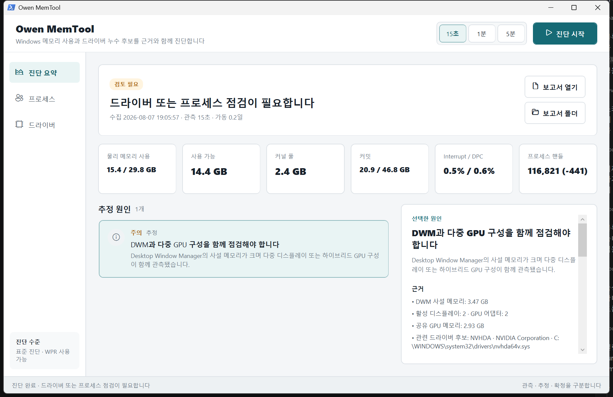

# Owen MemTool

Owen MemTool은 Windows 메모리 사용량을 프로세스, 커널 풀, CPU 인터럽트, 핸들, GPU, 드라이버 관점에서 함께 분석하고 추정 원인을 근거와 함께 설명하는 로컬 진단 도구입니다.

단순히 “메모리 80% 사용”을 경고하지 않습니다. 일반 프로세스로 설명되는 메모리와 커널·캐시·공유 GPU 메모리를 구분하고, 파일시스템 필터나 그래픽 드라이버 같은 후보를 `관측됨`, `추정`, `가능성 높음`, `확정`으로 나눠 표시합니다.



## 빠른 시작

### 요구 사항

- Windows 10 또는 Windows 11 64비트
- Windows PowerShell 5.1
- 별도 .NET SDK나 Python 설치 불필요

### 실행

1. 저장소를 다운로드하거나 압축을 풉니다.
2. `Start-Owen-MemTool.cmd`를 더블클릭합니다.
3. 관측 시간을 선택합니다.
4. **진단 시작**을 누릅니다.

PowerShell 실행 정책은 런처 프로세스에만 `Bypass`로 적용되며 시스템 설정을 변경하지 않습니다.

## 진단 범위

| 범위 | 수집 내용 |
|---|---|
| 물리 메모리 | 사용량, 사용 가능 메모리, 캐시, 압축 메모리 |
| 커밋 | 현재 커밋, 커밋 한계, 페이지 파일 |
| 커널 풀 | 비페이징 풀, 페이징 풀, 관측 구간 증가량 |
| CPU | Interrupt Time, DPC Time, Interrupts/sec, DPC Rate |
| 프로세스 | 작업 집합, 사설 메모리, 전체 커널 핸들, 관측 구간 핸들 변화 |
| 그래픽 | DWM, GPU 전용·공유 메모리, 어댑터와 디스플레이 구성 |
| 드라이버 | 이름, 경로, 벤더, 제품, 버전, 서명 상태 |
| 소프트웨어 | 드라이버 후보와 연관된 설치 프로그램·실행 프로세스(추정) |

## 관측 시간

- **15초**: 현재 상태를 빠르게 확인합니다. 지속 누수를 판정하기에는 짧습니다.
- **1분**: 짧은 작업 전후의 변화량을 비교합니다.
- **5분**: 드라이버 풀 증가를 `가능성 높음`으로 올릴 수 있는 최소 관측 구간입니다.

## 결과 해석

| 확신 수준 | 의미 |
|---|---|
| 관측됨 | 성능 카운터나 시스템 API에서 직접 확인한 값 |
| 추정 | 여러 관측값이 같은 후보를 가리키지만 직접 소유자는 확인되지 않음 |
| 가능성 높음 | 충분한 관측 시간 동안 후보와 일치하는 지속 증가가 확인됨 |
| 확정 | Pool Tag, 할당 스택 또는 재부팅 후 A/B 테스트로 인과관계가 확인됨 |

Owen MemTool 1.0.0은 일반 권한에서 `관측됨`부터 `가능성 높음`까지 판정합니다. `확정`에는 PoolMon 또는 WPR/WPA를 이용한 추가 검증이 필요합니다.

핸들 수치는 모든 프로세스의 커널 핸들 합계입니다. 정확한 `File` 타입 핸들의 소유자와 경로는 Sysinternals Handle 또는 WPR이 필요하며 Owen MemTool은 일반 핸들을 파일 핸들이라고 표시하지 않습니다.

## 보고서

진단이 끝나면 다음 파일이 `reports/`에 저장됩니다.

```text
reports/
├── report-YYYYMMDD-HHmmss.json
└── report-YYYYMMDD-HHmmss.md
```

JSON은 자동 처리용 원본이고 Markdown은 사람이 검토하기 위한 보고서입니다. 수집 데이터는 로컬에만 저장되며 네트워크로 전송되지 않습니다.

## 문서

- [사용 설명서](docs/USER-GUIDE.ko.md)
- [진단 방법론](docs/DIAGNOSTIC-METHODOLOGY.ko.md)
- [변경 이력](CHANGELOG.md)

## 개발 및 검증

```powershell
# 진단 코어 테스트
Invoke-Pester -Path .\tests

# UI 구조 검증
powershell.exe -NoProfile -ExecutionPolicy Bypass -STA `
  -File .\src\Owen-MemTool.ps1 -ValidateOnly

# 15초 실제 수집
powershell.exe -NoProfile -ExecutionPolicy Bypass `
  -File .\src\Collect-MemoryDiagnostics.ps1 `
  -OutputJson .\reports\manual-test.json `
  -OutputMarkdown .\reports\manual-test.md `
  -StatusPath "$env:TEMP\owen-memtool.status.json" `
  -DurationSeconds 15
```

## 안전 원칙

- 드라이버, 서비스, 프로세스를 진단 결과만으로 자동 삭제하거나 비활성화하지 않습니다.
- `cbfltfs4.sys` 같은 Boot 드라이버 파일을 직접 삭제하지 않습니다.
- 일반 프로세스 합계와 물리 메모리 차이를 그대로 “누수”로 판정하지 않습니다.
- Pool Tag 또는 A/B 테스트 전에는 특정 드라이버를 원인으로 확정하지 않습니다.

## 저장소

<https://github.com/towishy/owen-memtool>